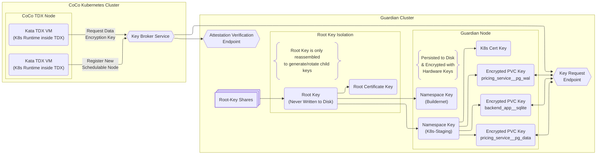
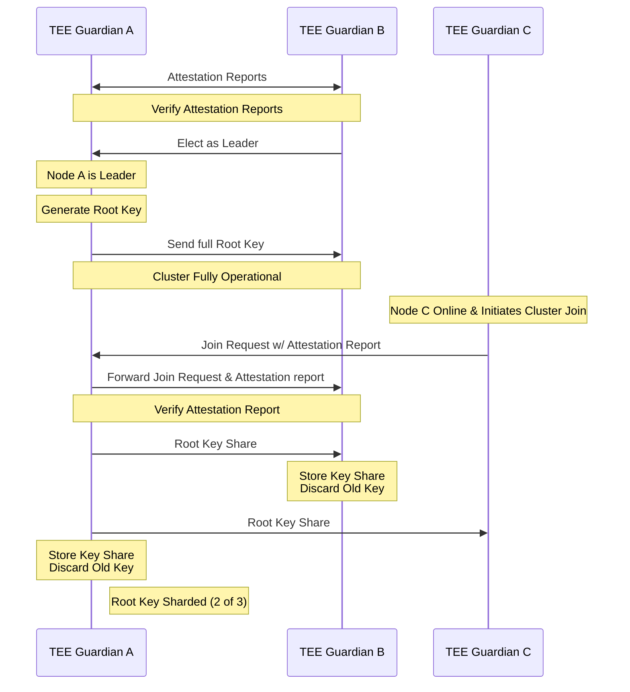

# TEE Guardian - Distributed Key Management System

A Byzantine fault-tolerant key management system running on Trusted Execution Environments, designed for high-availability TEE operations.
This service provides key-management and a certificate authority (TEE Identities) with attestation verification and
software measurement policies (Verify that kernel, userspace, and hypervisor are trusted)

## Architecture Overview

This system implements distributed threshold cryptography across multiple confidential VMs to improve
uptime and prevent a compromised TEE or physical hardware attack from accessing permanent root keys.
This service is implementation-agnostic, and allows operators to run multiple TEE implementations across multiple processor generations
to improve supply-chain/implementation vulnerability resiliency.

Root keys are protected using Shamir Secret Sharing (3-of-5 threshold) with hierarchical key derivation for application secrets.

## Service Functionality
1. **Bootstrap Service** - Allows untrusted TEEs to Attest & Mutually Verify to bootstrap the Service
2. **Measurement & Version Management** - Utilize centralized measurement policies & revocations
3. **Certificate Authority** -  Issues certificates to TEE nodes that meet measurement policies
4. **Key Management** - Controls access to keys and secrets for TEE applications


### Key Management

Key Management is a key architecture decision for TEE applications that need to persist data. For cache-style data, the CPU hardware
keys can be used, but if that CPU dies, there is no way to recover that data. A managed/cloud HSM service
is a common solution to this problem. This service bundles the key-management and attestation/verification into one highly
available service that can be deployed in a multi-cloud or a bare-metal onsite configuration.

The Root Key is used for deriving all other keys and certificates. As long as this Root Key is reconstructable, all
other keys in the cluster can be reconstructed. This Root Key is sharded amongst the guardians, so a compromised TEE
instance only has access to intermediate keys that can be rotated.

Keys are broken into namespaces. Each namespace has its own MeasurementWhitelist where trusted Software & Hardware Measurements
are registered, revoked, and updated. For a CoCo Kubernetes cluster, the MeasurementWhitelist would have the Kata-Container
measurements and the list of CPUs that are deployed in that cluster. Any TEE must authenticate to this namespace
before receiving a key to encrypt a volume, sign an Ethereum transaction, etc.

See [Measurement Registry](docs/measurement_registry.md) for details on measurement verification and the HTTP API.


### Certificate Authority

The Certificate Authority allows TEEs to use certificates for identity and authentication.
Each Application-Namespace has a distinct certificate, so TEEs only need to verify that their certificates
were both signed by the trusted namespace certificate to guarantee that they are both using supported TEEs and
the correct Software Stack.

This replaces complex attestation and measurement infrastructure for a confidential computing app with an `openssl verify`
command and setting the correct trusted root certs into the application config.

These certificates are used for authenticating to the key-management service, and can be reused for node-identity, attested TLS,
or nebula networking with configurable expiration/re-attestation windows.

See [TEE Platform Identification](docs/tee-platform-identification.md) for details on how TEE clients register and receive certificates.


**Key Derivation Strategy**:



## Bootstrap Sequence

One of the core abilities is the ability to bootstrap a cluster via mutual remote attestation. This allows 2 untrusted nodes to verify each other's attestation reports,
peer, and then begin generating and managing the cluster keys.

See [Bootstrap Sequence](docs/bootstrap_sequence.md) for the complete cluster formation protocol.



## Build System

All builds use versioned Nix files for complete reproducibility. Each version file is immutable once released to maintain a permanent build history.

### Building Complete Guest Image

```bash
nix build -f nix/releases/v0.1.0-tdx.nix
# result/
#   boot.img
#   OVMF.fd

# Verify build reproducibility
nix build -f nix/releases/v0.1.0-tdx.nix --rebuild --keep-failed
```

