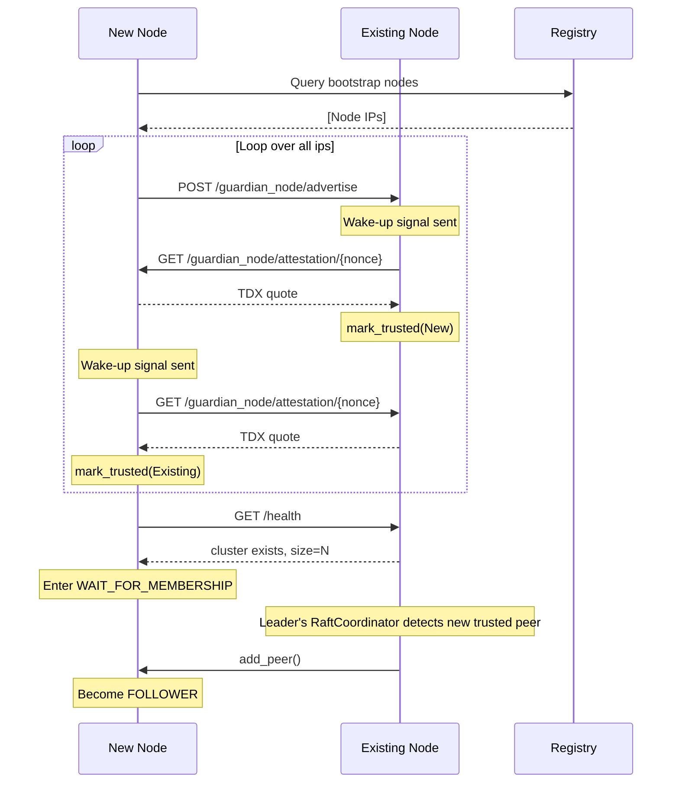
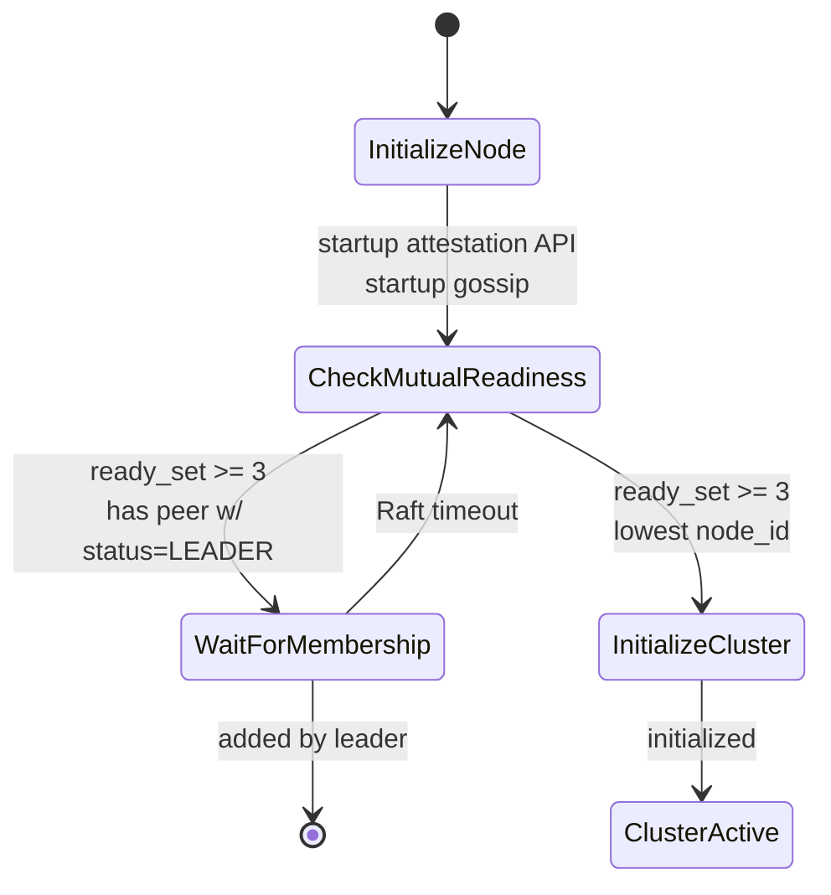
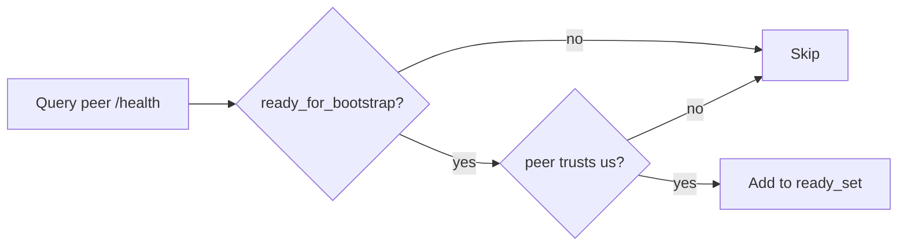

# Bootstrap Sequence

Cluster formation protocol for Guardian nodes. Ensures secure, deterministic formation with split-brain prevention.

**Design rationale**: RAFT has no attestation logic. Attestation is isolated in `PeerAttestationManager`, network security in `Router`, cluster formation in `RaftCoordinator`. This keeps RAFT auditable.

## Bootstrap Phases

### Phase 1: Initialization (~1-2s)
1. Init logging, metrics
2. Detect public IP (DHCP option 224)
3. Compute `node_id` from IP
4. [Skip for SEV-SNP] Load instance_id from tmpfs
6. Init `TrustedPeerRegistry` and `GossipedPeerCache`
7. Start API server (`/health`, `/metrics`, `/guardian_node/*`)
8. Generate gossip evidence: TDX quote binding addresses to TEE instance
9. Initial advertise: POST self-advertisement (with evidence) to all registry nodes
10. Start `PeerAttestationManager` with wake-up channel
11. Start `PeerGossipManager`
12. Create `RaftNode`
13. Start `RaftCoordinator`


### Phase 2: Peer Discovery & Mutual Attestation

Two discovery sources, unified attestation path:

| Source | Mechanism | Latency |
|--------|-----------|---------|
| Measurement Registry | Periodic query (10s default) | 1-10s |
| Gossip Advertisement | Wake-up signal on `/guardian_node/advertise` | <1s |
| Attestation Request | Wake-up signal on `/guardian_node/attestation/:nonce` | <1s |

**Wake-up flow** (fast path for new nodes):


Wake-up signals are deduplicated per-IP. If the same peer appears in both registry and gossip cache, only one attestation attempt occurs.


### Phase 3: Cluster Formation



### States

| State | Entry | Exit |
|-------|-------|------|
| **WaitForQuorum** | Startup | `trusted_count >= 2` |
| **DiscoverCluster** | Quorum reached | Query peer `/health`; branch on cluster existence |
| **CheckMutualReadiness** | No cluster found | Build ready set (mutual trust). If `>= 3` and lowest ID: bootstrap. Otherwise wait. |
| **Bootstrap** | Lowest ready node_id | Jitter delay, re-verify, call `initialize_cluster()` |
| **WaitForBootstrap** | Not lowest ready | Monitor peers; failover on 60s timeout |
| **WaitForMembership** | Cluster exists, not member | Leader adds us via `add_peer()`; 300s timeout |
| **ClusterActive** | Joined cluster | Leader monitors for new trusted peers |

## Mutual Readiness Protocol

A node is "ready" when:
1. Has attested enough peers (`>= MIN_PEERS`)
2. Not in a cluster (`cluster_size == 0`)
3. Responds to health checks
4. mutually verified



### Phase 4: Steady State

**Leader**: heartbeats (500ms), log replication, monitors for new trusted peers, calls `add_peer()`.

**Followers**: receive heartbeats, replicate logs, start election on timeout (1.5-3s).

**All**: Router trust-gates RPC, `PeerAttestationManager` continues attestation, `PeerGossipManager` pulls peer lists every 5 minutes.

## Adding a Node to Existing Cluster

This part is fairly straightforward. Re-using all of the bootstrap logic, the peer-manager
will detect peers, initialize a mutual attestation, and then if it passes, network traffic
will be allowed and the Raft network-unreachable errors will stop.

New node doesn't "request to join". Once mutually attested, the leader's `RaftCoordinator` adds it automatically.

## Guardian Node API

All peer-to-peer endpoints on port 8443:

| Endpoint | Method | Purpose |
|----------|--------|---------|
| `/guardian_node/attestation/:nonce` | GET | Generate TDX quote with nonce in report_data. Triggers wake-up if caller is unknown. |
| `/guardian_node/peers` | GET | Return known peer advertisements from gossip cache (max 50). |
| `/guardian_node/advertise` | POST | Receive TEE-authenticated peer advertisement. Verifies evidence, adds to cache, triggers wake-up. |

**Advertisement structure**:
```json
{
  "node_id": 3232266772,
  "raft_address": "192.168.122.20:8444",
  "api_address": "192.168.122.20:8443",
  "measurement_hash": "abc123...",
  "instance_id": "deadbeef...",
  "timestamp": 1704067200,
  "evidence": "<base64 TDX quote or SEV-SNP report>"
}
```

Each advertisement contains a TDX quote or SEV-SNP report that binds the advertised addresses to the TEE instance:

```
REPORTDATA (64 bytes):
┌────────────────────────────────────┬────────────────────────────────────┐
│ [0:32] Address Binding             │ [32:64] Instance ID | Zeroes       │
│ SHA256(raft_addr || api_addr)      │ Unique per-instance identifier     │
└────────────────────────────────────┴────────────────────────────────────┘
```

### Evidence Generation

At startup, each node generates gossip evidence once:

```rust
// In main.rs
let gossip_evidence = generate_gossip_evidence(&raft_address, &api_address, &instance_id).await?;

// Evidence contains:
// - REPORTDATA[0:32] = SHA256("192.168.1.10:8444" || "192.168.1.10:8443")
// - REPORTDATA[32:64] = instance_id if TDX 32 bytes of zeroes if SEV-SNP
```

## Security

### Trust Gate

```rust
// Router::send_rpc()
if !TrustedPeerRegistry::get().is_trusted(target).await {
    return Err(Unreachable("Peer not trusted"));
}
```

Untrusted peers cannot participate in RAFT (no heartbeats, elections, replication, or messages).
All RAFT network traffic is blocked unless the ipv4 target address is in our TrustedPeerRegistry

### Attestation Requirements

Peer added to `TrustedPeerRegistry` only after:
1. Valid TDX quote signature chain (Intel DCAP: AK certified by PCK, PCK certified by Intel Root CA)
2. Nonce binding in REPORTDATA (prevents replay)
3. Measurement hash (RTMRs) in registry whitelist

### Split-Brain Prevention

- Quorum: minimum 3 nodes to bootstrap
- Mutual trust: both sides must attest
- Deterministic: lowest `node_id` in ready set bootstraps
- Race prevention: jitter + re-verification


## Failure Scenarios

| Scenario | Recovery |
|----------|----------|
| Bootstrap node crashes | Others timeout (60s), rebuild ready_set, next lowest bootstraps |
| Leader failure | Followers detect missing heartbeats (1.5-3s), elect new leader |
| Network partition | Only partition with quorum operates; others rejoin on heal |
| Late-starting node | Advertises to registry nodes, wake-up triggers fast mutual attestation, leader adds via `add_peer()` |
| Asymmetric trust | Node waits in ready_set check until mutual trust established |
| Wake-up channel full | Falls back to periodic attestation cycle (10s) |


## Health Endpoint

```json
{
  "node_id": 3232266772,
  "status": "BOOTSTRAPPING | LEARNER | FOLLOWER | CANDIDATE | LEADER",
  "term": 0,
  "cluster_size": 0,
  "trusted_peers": [3232266773, 3232266774]
}
```

| Field | Description |
|-------|-------------|
| `node_id` | Derived from IP |
| `status` | RAFT state or `BOOTSTRAPPING` |
| `term` | RAFT term (0 if bootstrapping) |
| `cluster_size` | Voter count |
| `trusted_peers` | Attested node_ids |
