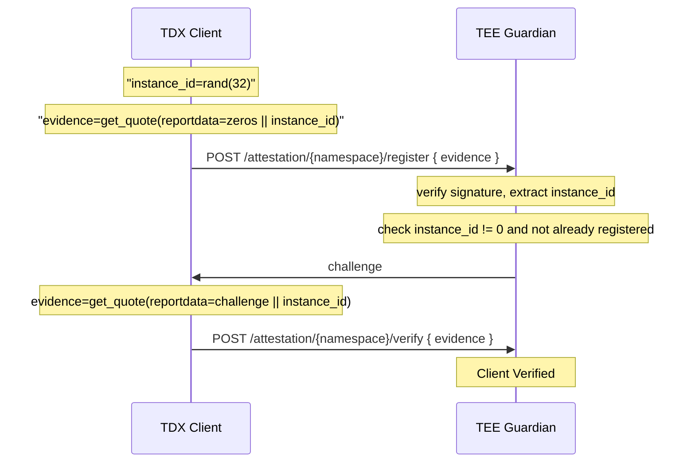
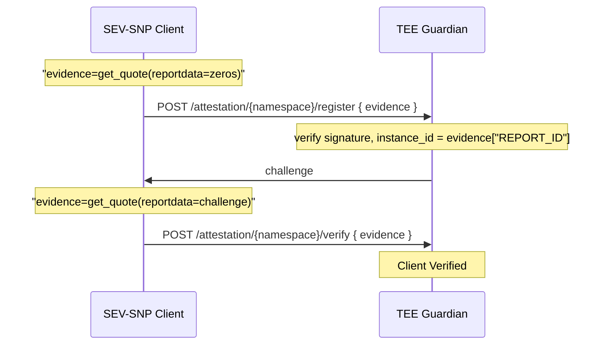

# TEE Platform Identification


| Platform | Per-Instance ID |  |
|----------|-----------------|---------------|
| TDX | `REPORTDATA[32:64]` | TDX has no built-in per-instance entropy, so on startup clients generate random 32 bytes to REPORTDATA |
| SEV-SNP | `REPORT_ID` (32B) | Automatically generated. Survives soft-reboots (reboot inside guest OS) but changes if hypervisor is killed and VM is re-created |


# Client Registration Flow

TEE applications register with Guardian via two-phase attestation.

### TDX



### SEV-SNP


### Error Responses

| Condition | HTTP | Description |
|-----------|------|-------------|
| TDX with zero instance_id | 409 | Client must have unique identity |
| instance_id already registered | 409 | Collision (replay or clone attack); both nodes revoked from Guardian |
| Measurement not in whitelist | 403 | Untrusted software |
| Invalid attestation signature | 400 | DCAP/SEV-SNP verification failed |
| Challenge mismatch | 401 | Phase 2 nonce binding incorrect |
| No pending challenge | 404 | Must call /register first |

### Certificate

After verification, Guardian issues a certificate bound to the instance_id. This can be used for authenticated requests without re-attestation.


# TDX Quote, Headers, and Signatures

These fields are set by the hypervisor/VMM during `TDH.MNG.INIT` and cannot be modified by the guest OS or applications.

| Field | Size | Set By | When | Purpose |
|-------|------|--------|------|---------|
| MRTD | 48B | TDX Module | TD build (TDH.MEM.PAGE.ADD) | SHA-384 of initial TD memory contents |
| MR_CONFIG_ID | 48B | VMM | TDH.MNG.INIT | orchestrator-assigned UUID, can be set via `-object tdx-guest,id=tdx,mrconfigid=<48-byte-hex-uuid>` |
| MR_OWNER | 48B | VMM | TDH.MNG.INIT | Tenant/owner identifier |
| MR_OWNER_CONFIG | 48B | VMM | TDH.MNG.INIT | Workload-specific configuration |
| TD_ATTRIBUTES | 8B | VMM | TDH.MNG.INIT | Debug flag, etc. |
| XFAM | 8B | VMM | TDH.MNG.INIT | Extended feature mask |


These fields are controlled by code running inside the TD and the software/firmware binaries:

| Field | Size | Set By | When | Purpose |
|-------|------|--------|------|---------|
| RTMR[0] | 48B | TDVF firmware | Boot | TDVF config, ACPI tables |
| RTMR[1] | 48B | Bootloader/OS | Boot | Kernel, initrd, boot params |
| RTMR[2] | 48B | OS/Application | Runtime | Applications, runtime config |
| RTMR[3] | 48B | Reserved | - | Reserved for special usage |
| REPORTDATA | 64B | Application | Quote request | Application-controlled binding |

RTMRs extend using `TDCALL[TDG.MR.RTMR.EXTEND]`: `RTMR[i] = SHA384(RTMR[i] || extension_data)`. All RTMRs initialize to zero at each boot.
Applications can either extend RTMR[3] or set REPORTDATA to seal a measurement.


#### Hardware/Platform Fields (Fixed per CPU)

| Field | Size | Source | Notes |
|-------|------|--------|-------|
| TEE_TCB_SVN | 16B | Quote body | CPUSVN + SEAM SVN + TDX TCB components |
| MRSEAM | 48B | Quote body | TDX Module measurement |
| MRSIGNERSEAM | 48B | Quote body | Module signer (zero for Intel-signed) |
| PPID | 16B | PCK cert extension | Platform Provisioning ID (unique per CPU) |
| FMSPC | 6B | PCK cert extension | Family-Model-Stepping-Platform-CustomSKU |
| PCE-ID | 2B | PCK cert extension | PCE identifier |

### Extracting Platform Identity (PPID)

PPID is the unique hardware identifier for the physical CPU package. It is not in the quote body but embedded in the PCK Certificate's X.509 extensions.

| OID | Field | Size | Description |
|-----|-------|------|-------------|
| 1.2.840.113741.1.13.1.1 | PPID | 16B | Platform Provisioning ID (unique per CPU) |
| 1.2.840.113741.1.13.1.2 | TCB | var | TCB component versions |
| 1.2.840.113741.1.13.1.3 | PCE-ID | 2B | PCE identifier |
| 1.2.840.113741.1.13.1.4 | FMSPC | 6B | CPU family/model/stepping |
| 1.2.840.113741.1.13.1.6 | Platform Instance ID | var | Platform instance (different from PPID) |

Extraction requires parsing the certification data in the quote signature:
1. Locate certification data block (offset in quote header)
2. Extract PCK certificate (first cert in PEM chain)
3. Parse X.509 extensions for OID `1.2.840.113741.1.13.1.1`
4. Value is 16-byte PPID (may be encrypted depending on registration model)


TDX 1.5 lacks native sealing. The planned `TDG.MR.KEY.GET` instruction (TDX 2.0) will enable sealing keys bound to:
- MRTD (software identity)
- MR_CONFIG_ID (instance identity)
- MR_OWNER (tenant identity)

# SEV-SNP Quote & Signature Structure

#### Firmware-Generated Fields (Set by AMD PSP)

| Field | Offset | Size | Set By | Description |
|-------|--------|------|--------|-------------|
| REPORT_ID | 0x020 | 32B | AMD PSP | Unique per guest context |
| CHIP_ID | 0x1A0 | 64B | Hardware fuses | Unique per physical CPU |
| SIGNATURE | 0x2A0 | 512B | VCEK | ECDSA signature over report |

**REPORT_ID** is the native instance identifier:
- Generated by PSP firmware at guest creation
- Statistically unique (random or derived)
- **Persists across warm reboots** (guest OS restart)
- Changes only on **cold boot** (VM termination + new launch)

#### VMM-Populated Fields (Set at Launch)

| Field | Offset | Size | Set By | Description |
|-------|--------|------|--------|-------------|
| HOST_DATA | 0x040 | 32B | Hypervisor | Container image digest, policy hash |
| GUEST_SVN | 0x008 | 4B | VMM | Guest security version |
| POLICY | 0x00C | 8B | VMM | Guest policy flags |

#### Guest-Populated Fields

| Field | Offset | Size | Set By | Description |
|-------|--------|------|--------|-------------|
| REPORT_DATA | 0x050 | 64B | Guest | Application-controlled binding |

#### Measurement Fields (Computed During Launch)

| Field | Offset | Size | Set By | Description |
|-------|--------|------|--------|-------------|
| MEASUREMENT | 0x090 | 48B | PSP | SHA-384 launch digest |
| ID_KEY_DIGEST | 0x114 | 48B | PSP | Guest owner's ID key hash |
| AUTHOR_KEY_DIGEST | 0x144 | 48B | PSP | Author signing key hash |

### AMD Certificate Extension OIDs

The VCEK certificate contains TCB version information in X.509 extensions:

| OID | Field | Description |
|-----|-------|-------------|
| 1.3.6.1.4.1.3704.1.1 | BlSpl | Bootloader Security Patch Level |
| 1.3.6.1.4.1.3704.1.2 | TeeSpl | TEE Security Patch Level |
| 1.3.6.1.4.1.3704.1.3 | SnpSpl | SNP Firmware Security Patch Level |
| 1.3.6.1.4.1.3704.1.4 | UcodeSpl | Microcode Security Patch Level |

### Key Derivation for Sealing

SNP guests request derived keys via `SNP_GET_DERIVED_KEY` with binding options:
- TCB_VERSION
- IMAGE_ID, FAMILY_ID
- MEASUREMENT
- GUEST_SVN, GUEST_POLICY

```
persistent_key = SNP_GET_DERIVED_KEY(
    root_key_select = VCEK,
    guest_field_select = MEASUREMENT | GUEST_SVN
)
```

This key survives reboots if MEASUREMENT and GUEST_SVN match.


